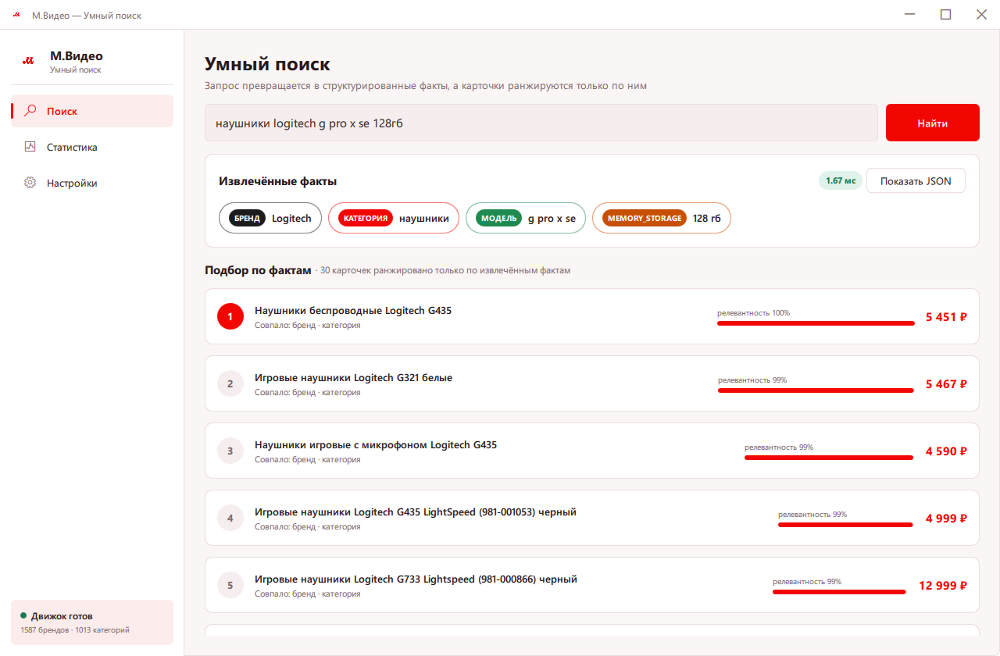
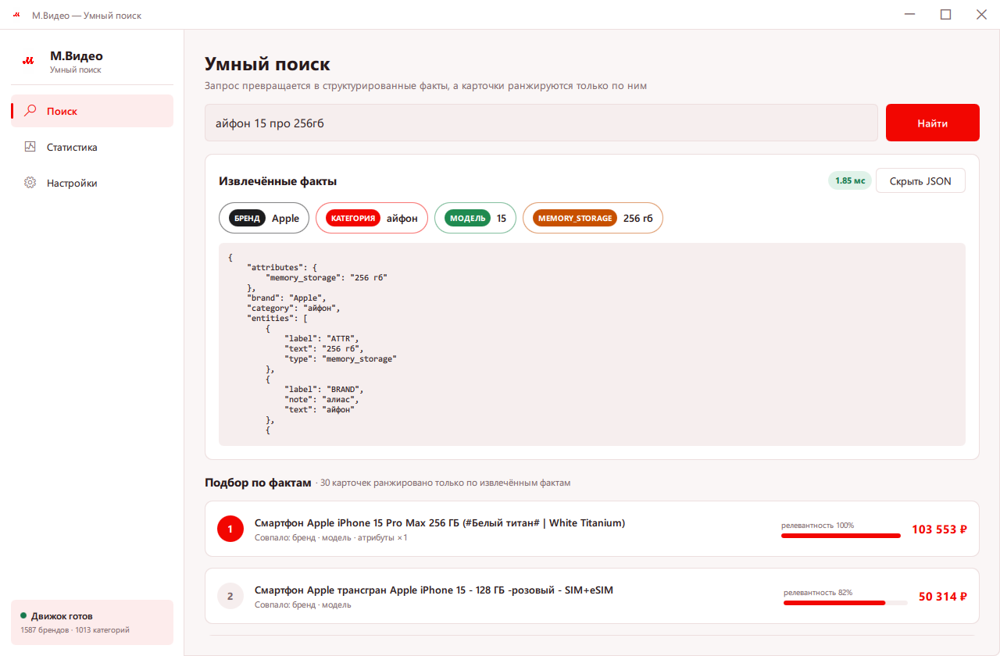
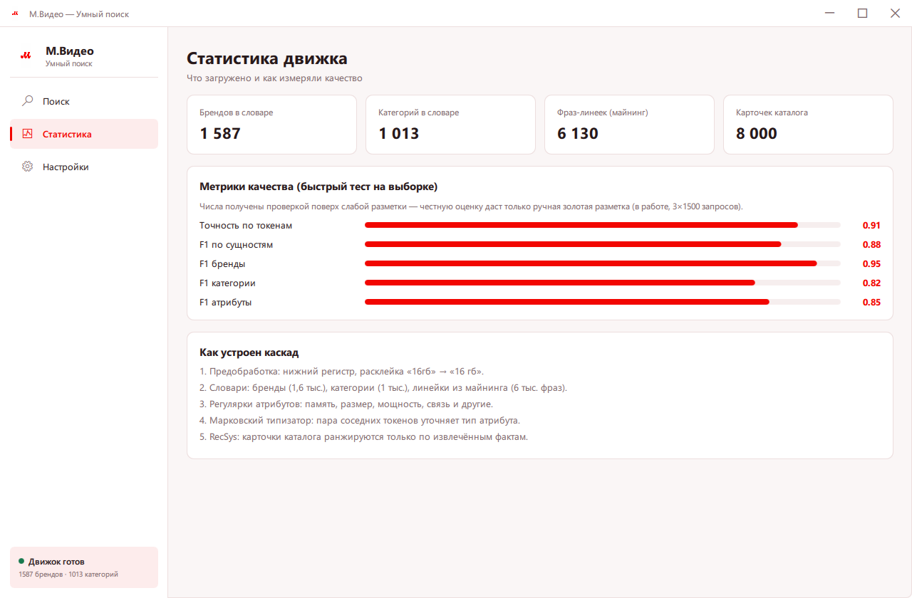
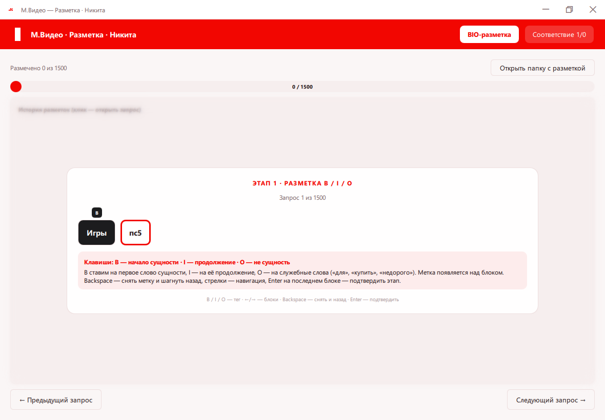
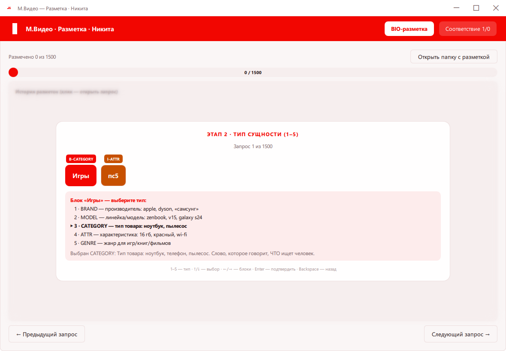
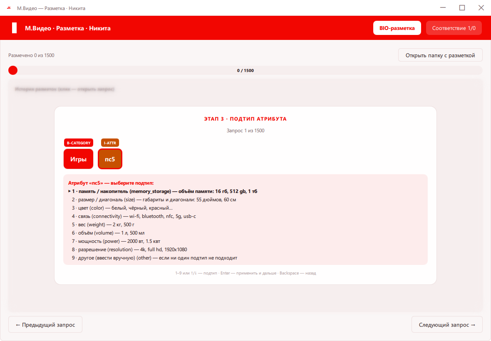
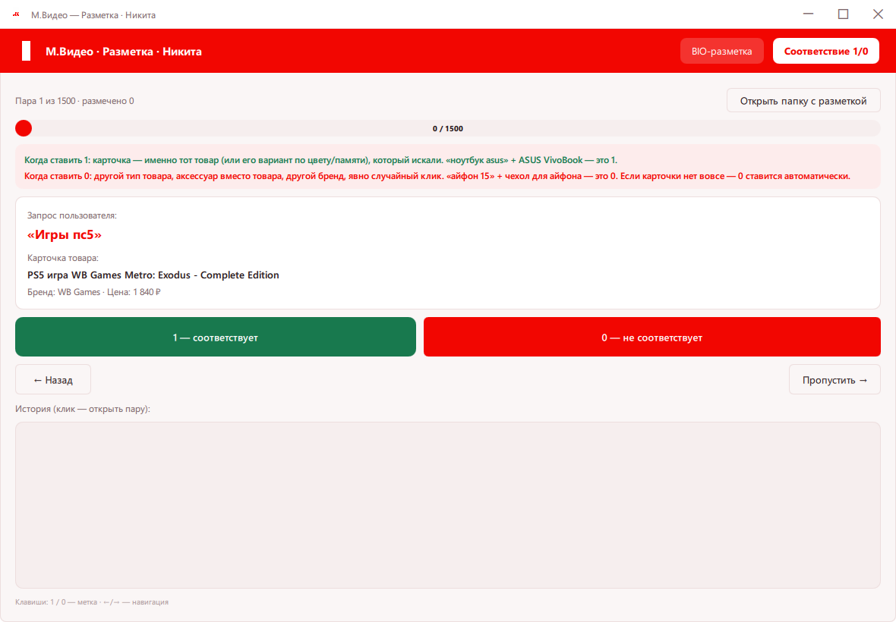

<div align="center">


# М.Видео · Интеллектуальный поиск

**Извлечение структурированных фактов из поисковых запросов за миллисекунды**


</div>

---

Пользователь пишет «ноутбук asus zenbook 16 гб серый» — система за миллисекунды понимает, *что* он ищет, и отдаёт структурированные факты, по которым можно искать и ранжировать каталог:

```json
{
  "query": "ноутбук asus zenbook 16 гб серый",
  "brand": "ASUS",
  "category": "ноутбук",
  "entities": [
    {"text": "ноутбук",  "label": "CATEGORY"},
    {"text": "asus",     "label": "BRAND"},
    {"text": "zenbook",  "label": "MODEL"},
    {"text": "16 гб",    "label": "ATTR", "type": "memory_storage"}
  ],
  "attributes": {"memory_storage": "16 гб", "color": "серый"},
  "latency_ms": 1.4
}
```

<div align="center">

<br><em>Умный поиск: факты чипами и каталог, отранжированный только по фактам</em>
</div>

## 🖥 Два нативных приложения (C++17 / Qt6 QML)

| | |
|:---:|:---:|
| <br>**Умный поиск** — раскрывающийся JSON, таймер извлечения в шапке | <br>**Статистика движка** — словари, каталог, метрики, каскад |
| <br>**Разметка · этап 1** — B/I/O с клавиатуры, метка над блоком | <br>**Разметка · этап 2** — тип на сущность целиком, с описаниями |
| <br>**Разметка · этап 3** — подтип атрибута, «другое» вручную | <br>**Соответствие 1/0** — гайд, авто-0 для пустых карточек |

### MVideo_SmartSearch_Setup — «Умный поиск»

Готовый установщик — в [Releases](../../releases). Анимированный вход, поиск с чипами фактов, раскрывающийся JSON, страница статистики и **RecSys по фактам**: карточки каталога ранжируются только по извлечённым фактам (бренд, категория, модель, атрибуты), не по сырому тексту. Извлечение — 1–2 мс. Тёмная тема в настройках.

### MVideo_Labeling_Setup — «Разметка» (один установщик на команду)

Три ярлыка в меню Пуск — **Никита, Некит, Лиза** — по 1500 непересекающихся запросов, плюс переключатель аккаунтов прямо в приложении. Трёхэтапный мастер:

1. **BIO** — клавиши `B`/`I`/`O` (работает и русская раскладка: `и`/`ш`/`щ`), метка над блоком, `Backspace` снимает и шагает назад;
2. **Тип сущности** — `1–5` или стрелками; тип ставится на сущность целиком (B I … I — одна группа);
3. **Подтип атрибута** — с описанием и переводом, «другое» — ручной ввод.

Режим **«Соответствие 1/0»** с гайдом (пустая карточка получает 0 автоматически), история с правкой, две кнопки «назад» (на начало запроса / на последнее состояние), крестик сворачивает мастер в историю. Всё сохраняется в JSONL рядом с приложением.

## 🏗 Архитектура: гибридный каскад

```
запрос ❯ ПРАВИЛА (словари · регулярки · модели) ❯ CRF ❯ КЛАССИФИКАТОР БРЕНДА ❯ МАРКОВСКИЙ ТИПИЗАТОР
                                                                                       │
                                             merge + нормализация → факты JSON, < 100 мс
```

| Слой | Что закрывает | Как учится |
|---|---|---|
| **Правила и словари** | явные бренды, «16 гб», линейки моделей | 7 словарей из каталога + майнинг |
| **CRF** | морфология, порядок слов, границы спанов | слабая (silver) BIO-разметка |
| **Классификатор бренда** | бренд не написан в тексте (73% кликов!) | silver из кликов: 67 классов, включая NO_BRAND и UNKNOWN |
| **Марковский типизатор** | тип атрибута: «16 гб» → память | частоты биграмм от регулярок-учителей |

### Классификатор бренда: 4 модели, честные отказы

Silver собран из кликов (28 664 запроса, 67 классов): бренды top-65 + `NO_BRAND` («холодильник» — бренда нет) + `UNKNOWN` (бренд вне списка — модель учится отказываться, а не угадывать). Обучены четыре линейные модели на TF-IDF; в прод выбрана **LogReg (слова 1–2 + символьные n-граммы 2–4)**: macro-F1 **0,950**, ложный бренд на запросах-категориях всего **6,9%**. Пороги отказа (`TAU_ACCEPT` 0.42, `TAU_MARGIN` 0.08) отсекают неуверенные ответы — лучше пусто, чем ложный Indesit.


## 📦 Структура репозитория

```
cpp/
├── mvsearch/             # «Умный поиск» — C++17 / Qt6 QML
│   ├── src/              #   движок: словари, регулярки, марковский типизатор, RecSys
│   └── qml/              #   интерфейс: сплэш, поиск, статистика, настройки
└── mvlabel/              # «Разметка» — C++17 / Qt6 QML, трёхэтапный мастер

src/
├── ner/                  # ядро NER (Python)
│   ├── labeling.py       #   слабая разметка: 7 словарей + 30 регулярок + лемматизация
│   ├── model_crf.py      #   CRF sequence labeling
│   └── markov_typer.py   #   марковский типизатор атрибутов
├── preprocessing/        # единый препроцессинг (расклейка, сепараторы, MODEL-спаны)
└── service/              # extractor + FastAPI-сервис

artifacts/                # словари (BRANDS, MODELS, COLORS, FEATURES, …) + brand_clf
models/                   # обученные модели (CRF, brand_clf, markov_typer)
notebooks/                # EDA + обучение классификатора бренда
installer/                # Inno Setup: два установщика
docs/                     # презентации Дней 1–3 (XeLaTeX, фирменный стиль)
figures/                  # 40+ графиков + скриншоты приложений
```

## 🛠 Стек

- **C++17 + Qt 6.8** (QML, Qt Quick Controls 2) — оба настольных приложения
- **CMake + MSVC 2022** — сборка
- **Inno Setup 6** — установщики (~17 МБ каждый)
- **Python 3.10+** — NER-пайплайн: pandas, scikit-learn, sklearn-crfsuite, pymorphy3
- **XeLaTeX** — презентации в фирменном стиле

## 🔨 Сборка

### Windows

Требования: Qt 6.5+ (MSVC), Visual Studio Build Tools, CMake, Inno Setup 6.

```powershell
# приложения
cd cpp/mvsearch && cmake -B build -DCMAKE_PREFIX_PATH="C:/Qt/6.8.2/msvc2022_64" && cmake --build build --config Release
cd cpp/mvlabel  && cmake -B build -DCMAKE_PREFIX_PATH="C:/Qt/6.8.2/msvc2022_64" && cmake --build build --config Release

# установщики
cd installer
iscc setup_mvsearch.iss
iscc setup_mvlabel.iss

# подпись кода (см. "Подпись и Windows Defender" ниже)
cd ..
powershell -ExecutionPolicy Bypass -File scripts\sign-windows.ps1
```

### Подпись и Windows Defender

Установщики подписаны кодовым сертификатом (`scripts/sign-windows.ps1`), поэтому вместо «Неизвестный издатель» Windows показывает **M.Video NER Search Team**. Важная оговорка: это **self-signed** сертификат — настоящий сертификат от доверенного CA (DigiCert, Sectigo и т.п.) стоит денег и требует регистрации юр. лица с проверкой, это невозможно сделать бесплатно и мгновенно для учебного проекта. Из-за этого SmartScreen у случайного пользователя из интернета всё равно может показать предупреждение «Windows защитила ваш компьютер» — так работает репутационная система Microsoft для любых новых бинарников, не только неподписанных.

Чтобы полностью убрать предупреждение у себя/команды — один раз добавить сертификат в доверенные (не нужны права администратора):

```powershell
certutil -user -addstore -f "Root" installer\certs\mvideo_codesign.cer
```

После этого `Get-AuthenticodeSignature` на установщиках показывает `Valid`, SmartScreen не блокирует запуск. Приватный ключ (`.pfx`) в репозиторий не попадает — используется только локально при подписи.

### macOS

CMake-файлы обоих приложений кросс-платформенные (`MACOSX_BUNDLE`, `.icns`, пути к данным и к разметке через `QStandardPaths` на маке), но собрать `.app`/`.dmg` можно только **на самом Mac** — Qt для macOS компилируется под конкретную ОС, кросс-компиляция с Windows не поддерживается.

#### 1. Что поставить

```bash
# компилятор Apple (clang++)
xcode-select --install
# если уже стоит, но cmake не видит компилятор:
sudo xcode-select -s /Library/Developer/CommandLineTools
clang++ --version

# сборка
brew install cmake ninja

# Qt (Homebrew) + модули, которые macdeployqt часто ищет
brew install qt qtsvg qtvirtualkeyboard
```

Альтернатива Qt: [Online Installer](https://www.qt.io/download-qt-installer) → компонент **macOS** (например `~/Qt/6.8.2/macos`). Для раздачи `.dmg` на другие маки он надёжнее Homebrew.

#### 2. Как найти Qt

```bash
# Homebrew (рекомендуемый путь для скрипта)
brew --prefix qt
# обычно: /opt/homebrew/opt/qt

ls "$(brew --prefix qt)/lib/cmake"
ls "$(brew --prefix qt)/bin/macdeployqt"

# Qt Online Installer
ls ~/Qt
find ~/Qt -maxdepth 3 -type d -name macos 2>/dev/null

# если qmake в PATH
which qmake
qmake -query QT_INSTALL_PREFIX
```

Не указывай путь вида `/opt/homebrew/Cellar/qt/6.11.1` — бери symlink:

```bash
$(brew --prefix qt)   # → /opt/homebrew/opt/qt
```

#### 3. Сборка

```bash
git clone https://github.com/xWooshieL/mvideo-ner-search.git
cd mvideo-ner-search
chmod +x scripts/build-macos.sh

# чистая пересборка (если уже пробовали и упало)
rm -rf cpp/mvsearch/build-macos cpp/mvlabel/build-macos dist-macos

# Homebrew
./scripts/build-macos.sh "$(brew --prefix qt)"

# или Qt Online Installer
./scripts/build-macos.sh ~/Qt/6.8.2/macos
```

Скрипт сам сгенерирует `.icns` из `.iconset` (см. `scripts/make_iconset.py`), соберёт оба `.app` через CMake, прогонит `macdeployqt` (с `-libpath` по всем `/opt/homebrew/opt/qt*/lib`) и упакует в `.dmg` — результат в `dist-macos/`.

```bash
ls dist-macos
open dist-macos/*.app
```

#### 4. Типичные проблемы

| Симптом | Что делать |
|---|---|
| `cmake: command not found` | `brew install cmake` |
| `unable to find a build program corresponding to "Ninja"` | `brew install ninja` |
| `CMAKE_CXX_COMPILER not set` | `xcode-select --install`, затем `sudo xcode-select -s /Library/Developer/CommandLineTools` |
| `Cannot resolve rpath … QtVirtualKeyboard / QtSvg / QtPdf` | Homebrew Qt разбит на keg'и. Поставь `brew install qtsvg qtvirtualkeyboard` и запускай скрипт через `"$(brew --prefix qt)"`. Скрипт сам прокидывает `-libpath`. Для локального запуска часто терпимо; для раздачи лучше Qt Online Installer. |
| Куча `warning: 'operator""_qs' is deprecated` | Это **не ошибка**. В Qt 6.8+ `_qs` устарел в пользу `_s`. Сборка должна продолжаться. |
| `macdeployqt` вернул ненулевой код, но `.app` есть | Для локального Mac обычно ок. Проверь `open dist-macos/*.app`. |
| Краш при запуске: `Code Signature Invalid` / `CODESIGNING Invalid Page` / «файл повреждён» | После `macdeployqt` подпись битая. Скрипт теперь делает ad-hoc `codesign` сам. Вручную: см. ниже. |

#### 5. Как запустить готовый `.app`/`.dmg`

1. Открой `dist-macos/MvSearch.dmg` (или `MvLabel.dmg`), перетащи `.app` в `Applications` (или запускай прямо из `dist-macos/`).
2. Приложение **не подписано Apple Developer ID** (это платная программа $99/год) и не нотаризовано. На macOS 15 без ad-hoc подписи часто сразу краш:
   `EXC_BAD_ACCESS (SIGKILL (Code Signature Invalid))` / `Termination Reason: CODESIGNING, Code 2 Invalid Page`.
3. Лечение (один раз на копию `.app`):
   ```bash
   # путь подставь свой
   APP="dist-macos/MvLabel.app"   # или MvSearch.app / /Applications/MvLabel.app

   xattr -cr "$APP"
   codesign --force --deep --sign - "$APP"
   open "$APP"
   ```
   - `xattr -cr` снимает quarantine (флаг «скачано из интернета»).
   - `codesign --sign -` — ad-hoc подпись всей пачки (бинарь + Qt frameworks внутри бандла).
4. GUI-вариант, если краша нет, а только диалог Gatekeeper: правый клик → «Открыть» → «Открыть всё равно» (`System Settings → Privacy & Security → Open Anyway`).
4. Данные (словари/каталог для поиска, JSON запросов для разметки) лежат в `*.app/Contents/Resources/data` — переносить `.app` можно целиком.

#### 6. Как обновлять установщики / приложения после правок в git

**Git сам по себе установленные приложения не обновляет.** Нужна пересборка и раздача новых артефактов.

**macOS — обновить разметку БЕЗ потери labels (для участницы со старой версией):**
```bash
cd mvideo-ner-search
git pull
./scripts/build-macos.sh "$(brew --prefix qt)"          # или скачай .dmg/.app из Releases
chmod +x scripts/update-macos-label.sh
./scripts/update-macos-label.sh                         # ставит dist-macos/MvLabel.app
# или: ./scripts/update-macos-label.sh ~/Downloads/MvLabel.dmg
```
Скрипт делает бэкап на Desktop, закрывает старое приложение, заменяет `/Applications/MvLabel.app`.
**Разметка не внутри .app** — она в `~/Library/Application Support/MVideo/.../labels/`, поэтому замена бандла её не трогает. С v0.1.1 то же на Windows: labels в `%APPDATA%\MVideo\...`, при обновлении Setup.exe прогресс сохраняется (есть миграция со старой папки рядом с exe).

**macOS (полная пересборка обоих приложений):**
```bash
cd mvideo-ner-search
git pull
rm -rf cpp/mvsearch/build-macos cpp/mvlabel/build-macos dist-macos
./scripts/build-macos.sh "$(brew --prefix qt)"
# новые .app/.dmg лежат в dist-macos/ — ими и пользуйся / раздай команде
```

**Windows:**
```powershell
git pull
# пересобрать приложения (пути к Qt свои)
cd cpp/mvsearch; cmake --build build --config Release; cd ../..
cd cpp/mvlabel;  cmake --build build --config Release; cd ../..
cd installer
iscc setup_mvsearch.iss
iscc setup_mvlabel.iss
# готовые Setup.exe — в installer/output
# выложить в GitHub Releases, чтобы команда скачала заново
```

Коротко: `git push` → на машине сборки `git pull` → собрать → отдать новые Setup.exe / .dmg. Уже установленные копии сами не подтянутся. Для macOS-разметки используй `update-macos-label.sh`, чтобы не потерять labels.

Python-пайплайн:

```bash
pip install -r requirements.txt

# извлечение фактов
python -c "
from src.service.extractor import QueryEntityExtractor
ex = QueryEntityExtractor.from_artifacts()
print(ex.extract('пылесос dyson v15'))
"

# слабая разметка на 7 словарях
python -c "
from src.ner.labeling import WeakLabeler
wl = WeakLabeler.from_dir('artifacts')
print(wl.label_query('телевизор samsung 55 дюймов чёрный'))
"
```

## 📊 Метрики

> Числа на silver-валидации — проверка «повторила ли модель правила», поэтому оптимистичны.
> Честную оценку даст ручная золотая разметка (собираем приложением, 3×1500 запросов).

| Компонент | Метрика | Значение |
|---|---|---|
| Классификатор бренда (LogReg слова+симв.) | macro-F1 | **0,950** |
| Классификатор бренда | ложный бренд на категориях | **6,9%** |
| Классификатор бренда | F1 NO_BRAND / UNKNOWN | 0,88 / 0,86 |
| CRF на слабой разметке | точность по токенам | 0,91 |
| CRF | F1 по сущностям | 0,875 |
| Марковский типизатор | точность против правил | 0,62 (36% — честное «не знаю») |
| C++ движок | извлечение фактов | 1–2 мс |

## 🗺 Roadmap

| Этап | Что планируется |
|---|---|
| Золотая разметка | 3×1500 запросов командой через приложение, честный тест и калибровка порогов |
| CRF v2 | переобучение на разметке с тегом MODEL, сверка с золотой |
| RNN-типизатор | лёгкая BiLSTM для спанов, где цепь говорит «не знаю» (36%) |
| Модель 1/0 | бустинг на ручных парах запрос↔карточка, чистка кликового шума |
| macOS-сборка | код и CMake готовы (`scripts/build-macos.sh`) — осталось прогнать на реальном Маке и подписать |
| EV code-signing сертификат | сейчас установщики подписаны self-signed сертификатом; платный сертификат от доверенного CA убрал бы предупреждение SmartScreen у всех, не только у команды |

## 👥 Команда

Буткемп-команда М.Видео: **Никита · Некит · Лиза**
