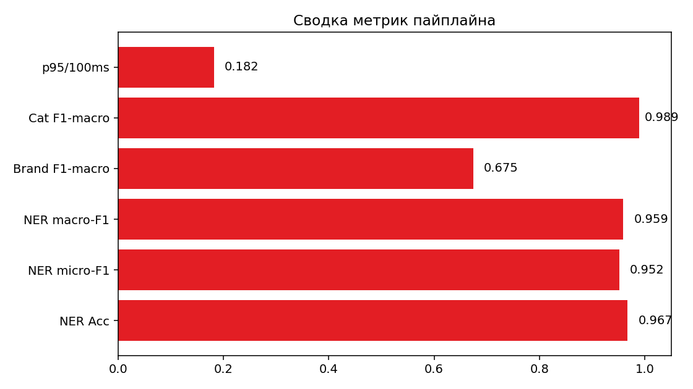
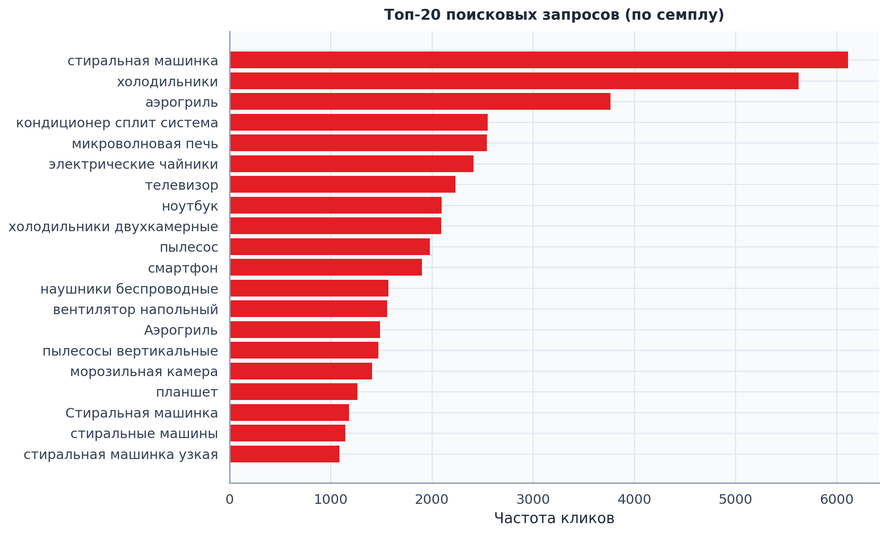
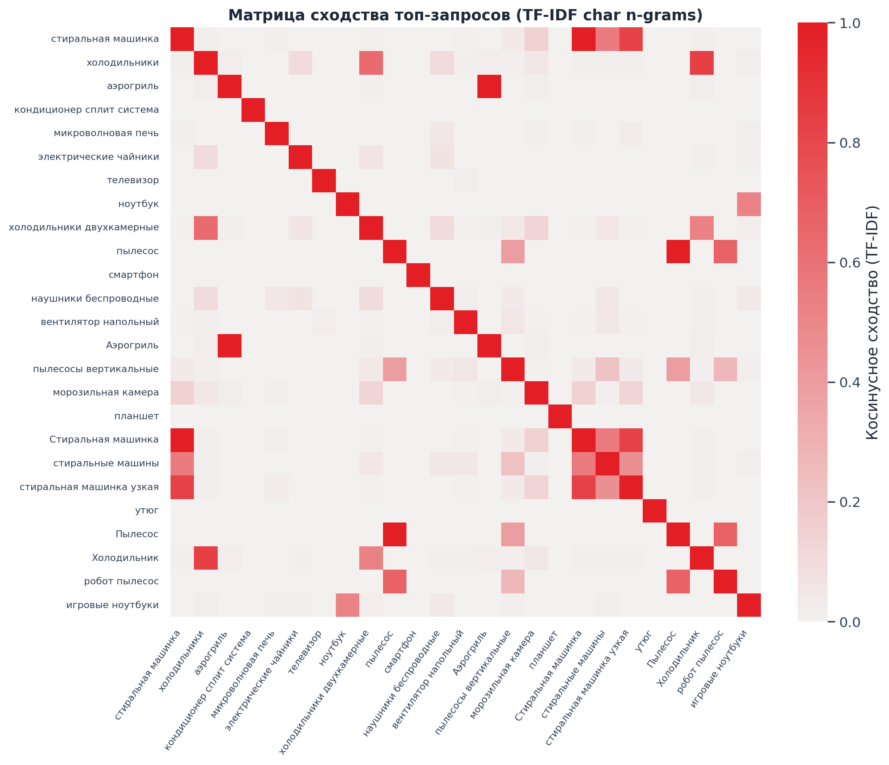

# М.Видео — Интеллектуальный поиск (NER)

[](https://python.org)
[](#)
[](#)

Решение кейса буткемпа: **извлечение сущностей из поисковых запросов** e-commerce (бренд, категория, характеристики) и выдача структурированного JSON **быстрее 100 мс**.

**Репозиторий:** https://github.com/xWooshieL/mvideo-ner-search  
**Админ-коллаборатор:** [Nizier193](https://github.com/Nizier193)

---

## Задача

Поисковая система М.Видео должна понимать, *что* ищет пользователь: категорию товара, бренд и атрибуты. Точность разбора запроса напрямую влияет на релевантность выдачи и конверсию.

```json
{
  "query": "ноутбук asus 16 гб",
  "entities": [
    {"text": "ноутбук", "label": "CATEGORY", "span": [0, 7], "source": "dict"},
    {"text": "asus", "label": "BRAND", "span": [8, 12], "source": "dict"},
    {"text": "16", "label": "ATTR", "span": [13, 15], "source": "dict"},
    {"text": "гб", "label": "ATTR", "span": [16, 18], "source": "crf"}
  ],
  "brand": "ASUS",
  "category": "ноутбук",
  "attributes": {"16": "ATTR", "гб": "ATTR"},
  "latency_ms": 2.4
}
```

---

## Данные (локально, не в git)

| Файл | Размер | Содержание |
|------|--------|------------|
| `файлы/query_clicks.parquet` | ~621 MB | **30.99M** кликов: запрос → SKU, бренд, цена, позиция |
| `файлы/sku_desc.parquet` | ~336 MB | **1.18M** карточек: `sku_id`, `title`, `description` |
| `файлы/skus.pkl` | ~1.46 GB | YML-каталог (`yml_catalog → shop`) |

Ключевые поля кликов: `query_text`, `sku_brand_name`, `sku_name`, `sku_price`, `sku_position`, `sku_subject_id`.

---

## Архитектура решения

```
Запрос → токенизация
       → словарь брендов / категорий (exact + fuzzy)
       → CRF NER (BIO: BRAND / CATEGORY / ATTR)
       → merge + канонизация бренда
       → JSON (< 100 мс)
```

Дополнительно: baseline **TF-IDF (char n-grams) + LogisticRegression** для предсказания бренда по запросу.

---

## Структура репозитория

```
мвидео/
├── notebooks/          # 12 Jupyter-ноутбуков (EDA → NER → сервис)
├── figures/            # 20+ PNG визуализаций анализа
├── src/
│   ├── data_utils.py
│   ├── ner/            # labeling, CRF, metrics, extractor
│   └── service/app.py  # FastAPI
├── scripts/run_pipeline.py
├── artifacts/          # словари, metrics.json
├── models/             # crf_ner.pkl, brand_tfidf_logreg.joblib
├── docs/               # LaTeX-документация
└── requirements.txt
```

---

## Быстрый старт

```bash
pip install -r requirements.txt

# Полный пайплайн: EDA-графики + словари + baseline + CRF + бенчмарк
python scripts/run_pipeline.py

# API + красивый demo UI (поиск + отладка JSON/BIO)
uvicorn src.service.app:app --reload --port 8000
# Открой http://localhost:8000
# POST /extract         {"query": "пылесос dyson"}
# POST /extract/debug   + BIO словарь/CRF для отладки
```

UI лежит в `web/` — подсветка сущностей, карточки фактов, latency vs SLA, история запросов, копирование JSON.

Ноутбуки: `notebooks/01_…` → `12_…` (все вычисления продублированы / запускаются из `.ipynb`).

---

## Метрики (факт)

Из [`artifacts/metrics.json`](artifacts/metrics.json):

| Блок | Метрика | Значение |
|------|---------|----------|
| CRF NER | Token Accuracy | **0.967** |
| CRF NER | Entity micro-F1 | **0.948** |
| NER · BRAND | F1 | **0.979** |
| NER · CATEGORY | F1 | **0.914** |
| NER · ATTR | F1 | **0.986** |
| Brand TF-IDF+LogReg | Accuracy / F1-macro | **0.721** / **0.675** |
| Category TF-IDF+LogReg | Accuracy / F1-macro | **0.988** / **0.989** |
| Latency | p50 / p95 / max | **14 / 34 / 96 мс** (SLA &lt; 100 мс ✅) |

---

## Визуализации

**29 PNG** в `figures/` — длины запросов, топ брендов, heatmaps, confusion matrix, learning curve NER, t-SNE, latency, wordcloud и др.





---

## Документация

- LaTeX: [`docs/Документация_МВидео_NER.tex`](docs/Документация_МВидео_NER.tex) (стиль как у документации Музклуба ЦУ)
- Сборка: `cd docs && pdflatex Документация_МВидео_NER.tex`

---

## Программа буткемпа

| День | Фокус |
|------|--------|
| 01 | Погружение и планирование |
| 02 | Исследование (EDA) |
| 03 | Прототипирование (модель) |
| 04 | Доработка и упаковка (MVP + презентация) |
| 05 | Защита и ретроспектива |

---

## Команда

- Репозиторий: [@xWooshieL](https://github.com/xWooshieL)
- Admin: [@Nizier193](https://github.com/Nizier193)
