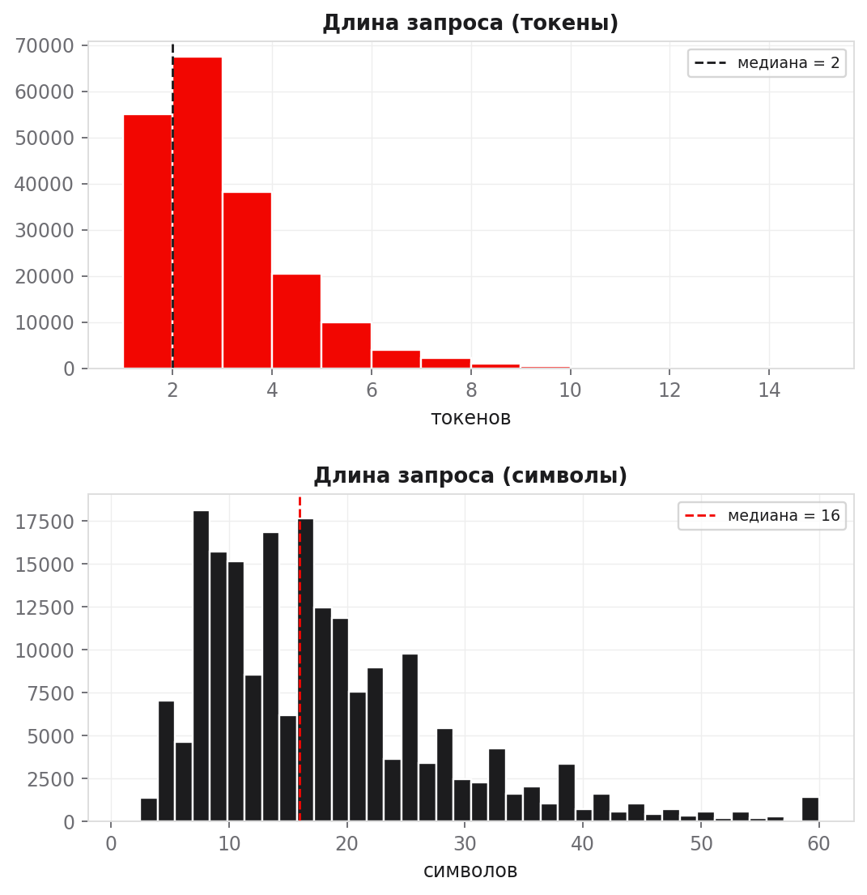
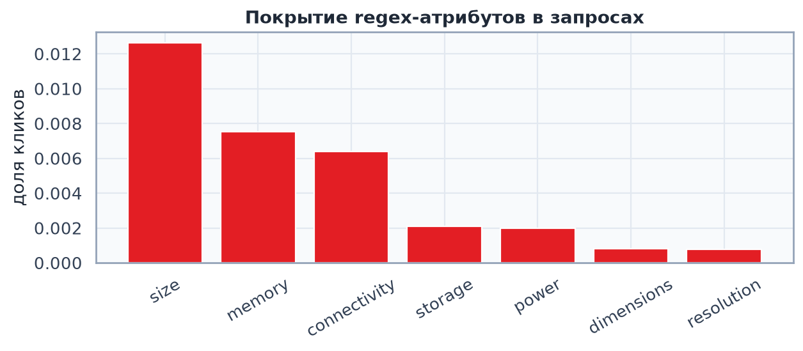
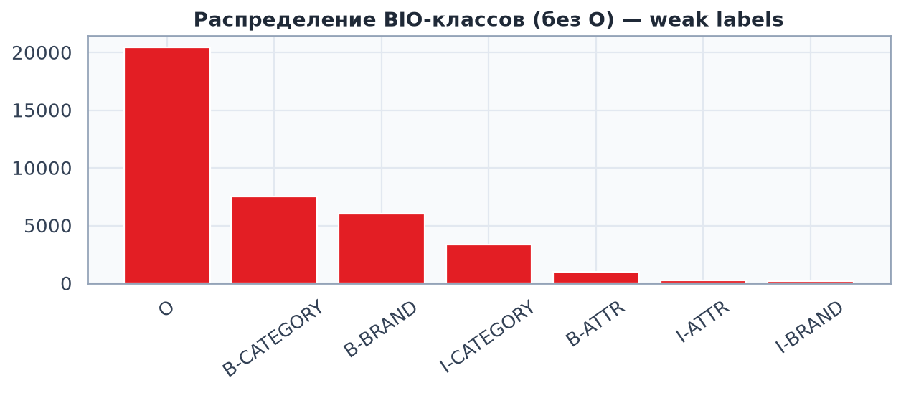
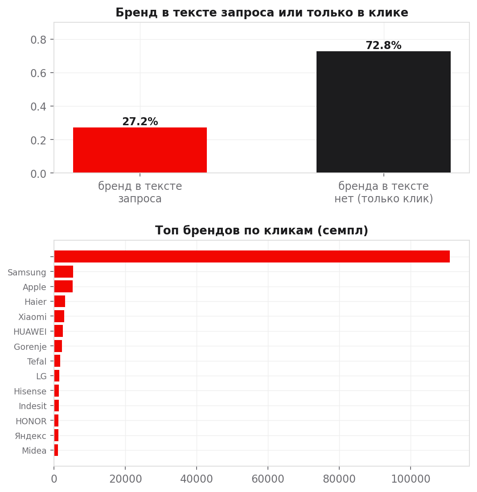
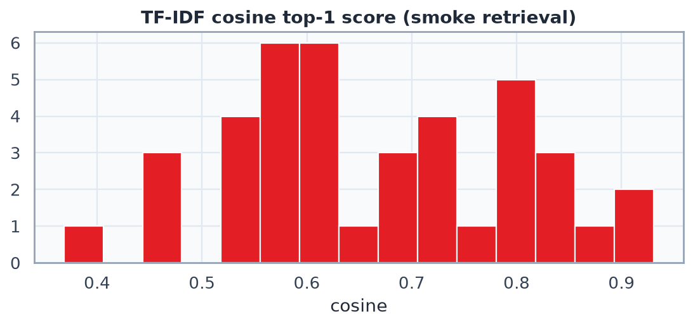
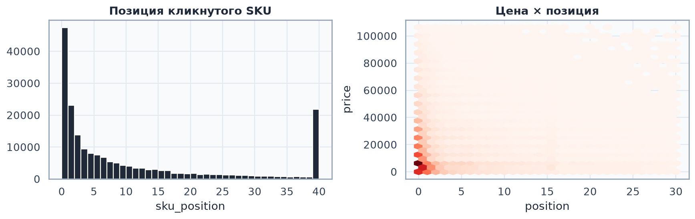

# Complex EDA: методы решения задачи M.Video NER

Отчёт связывает **данные** (`query_clicks`, `sku_desc`, словари) с **выборами моделей**: зачем каждый метод применим, на чём учится, какой вход/выход, какие графики это подтверждают.

Три сводных ноутбука (весь EDA собран здесь; ранние разведочные ноутбуки — в `notebooks/_legacy/`):
- [`01_data_and_methods_eda.ipynb`](./01_data_and_methods_eda.ipynb) — масштаб данных, бренды, обзор и обоснование методов каскада  
- [`02_model_tag_eda.ipynb`](./02_model_tag_eda.ipynb) — **статистическое обоснование тега `MODEL`**, майнинг `model_phrases.txt`, кривая «порог майнинга ↔ покрытие»  
- [`03_attr_types_eda.ipynb`](./03_attr_types_eda.ipynb) — **обоснование подтипов ATTR**, омонимия чисел, Markov vs RNN

> Целевой вход продакшена — **поисковый запрос**, выход — структурированные факты (`brand`, `category`, `attributes`) за **&lt; 100 мс**.  
> Клики и карточки SKU — **топливо** для словарей, weak labels и retrieval, а не объект парсинга в инференсе.

Графики: `figures/complex_eda/`. Числовые артефакты EDA: `artifacts/complex_eda_method_stats.json`, `artifacts/model_tag_eda_stats.json`, `artifacts/markov_attr_eda_stats.json`.  
Честные метрики модулей на gold: `artifacts/metrics/` (см. `scripts/eval_on_gold.py`).

---

## Статистическое обоснование выбранных сущностей и типов

Кратко (числа — из `artifacts/gold/gold_stats.json` на 200 gold-запросах и silver-статистик пайплайна):

### Почему нужен отдельный тег `MODEL` (а не ATTR/шум)
- В gold `MODEL` встречается **74 раза** на 200 запросов — это ~35% запросов, сопоставимо с ATTR (91). Линейки (`zenbook`, `v15`, `a15`, `tuf`) — не бренд и не атрибут, но критичны для поиска.
- Правила/словари ловят `MODEL` слабо (gold recall **0.15**), поэтому нужен **майнинг `model_phrases.txt`** из `sku_name` + подача в CRF. С `models_path` silver получает MODEL B-теги (663 на срезе 5k), без него — почти нули.
- Порог майнинга (частота фразы) выбран по кривой «размер словаря ↔ покрытие» в `02_model_tag_eda`: слишком низкий тащит шум, слишком высокий теряет длинный хвост линеек.

### Почему такие подтипы ATTR
Распределение подтипов в gold (`attr_subtype_counts`):

| подтип (gold) | n | канон teacher |
|---|---:|---|
| type | 43 | `type` |
| memory_storage | 22 | `memory_storage` |
| purpose | 13 | `purpose` |
| size | 4 | `size` |
| volume / color / game / weight | 4 / 4 / 4 / 3 | volume / color / type / weight |
| остальные (≈15 редких) | 1–2 | мапятся в `type`/`other` (`data/gold/ATTR_SUBTYPES.md`) |

Выводы, которые определили онтологию типизатора:
1. **`type` и `purpose` — не «прочее».** Вместе это **56/91** ATTR-спанов gold. Поэтому в `labeling.py` заведены лексические `TYPE_SEEDS` / `PURPOSE_SEEDS` и правило «для …», а не только числовые единицы.
2. **`memory_storage` — самый частый числовой тип** (усечения `16 г`/`256 g` реальны в поиске) → отдельная обработка RAM-подобных чисел.
3. **Длинный хвост редких подтипов** (`depth`, `chip`, `material`, `release date`…) сведён к `type`/`other` через `GOLD_TO_CANON`: обучать по 1–2 примера бессмысленно, а reject-порог типизатора отправляет неуверенное в `UNKNOWN`.
4. Онтология синхронизирована с приложением разметки (MvLabel) — gold мы **не переразмечаем**, а маппим (`gold_subtype_to_canon`).

---

## 0. Картина данных (сводка EDA)

| Источник | Масштаб | Роль в решении |
|---|---:|---|
| `query_clicks.parquet` | **30 991 350** строк | Тексты запросов + кликнутый бренд/SKU/цена/позиция |
| `sku_desc.parquet` | **1 177 200** карточек | Title/description для словарей и embedding-retrieval |
| `skus.pkl` | ~1.57 GB | YML-каталог |
| `artifacts/dicts/brands.txt` | ~1.6k | Exact/fuzzy + weak BIO |
| `artifacts/dicts/categories.txt` | ~1.4k | То же для CATEGORY |

Оценки по случайному семплу кликов (~150–200k):

| Метрика | Значение |
|---|---:|
| Уник. запросов / SKU / брендов / subject | ~39–59k / ~52–60k / ~2.9–3.1k / ~1.7–1.9k |
| Длина запроса, токены p50 / p90 / p99 | **2 / 4 / 7** |
| Длина запроса, символы p50 / p90 | **17 / 31** |
| Доля кликов: бренд **есть в тексте** запроса | **~27%** |
| Доля кликов: бренд **только у SKU** (нет в тексте) | **~73%** |
| Weak BIO: запросы с ≥1 сущностью | **~80%** |
| Weak: BRAND / CATEGORY / ATTR | **~46% / ~59% / ~7%** |
| Запросы с ≥2 типами сущностей / с `I-*` | **~29% / ~27%** |
| Regex ATTR (любой паттерн) | **~3.1%** кликов |
| Запросы с ≥2 разными брендами в кликах | **~17%** |

**Вывод:** это короткий **query understanding**, не document-NER. Много бокового сигнала из кликов → гибрид **правила + sequence labeler + классификаторы**.



---

## 1. Правила и словари (regex / gazetteers)

### Описание
Детерминированный слой: longest-match бренда/категории + regex атрибутов. Мат. модели нет.

### На чём «учится»
Не учится. Словари из `sku_brand_name` / категорий; regex — `ATTR_PATTERNS` в `src/ner/labeling.py`.

### Пример входа / выхода

| | |
|---|---|
| **Вход** | `ноутбук asus 16 гб` |
| **Выход** | `ноутбук→CATEGORY`, `asus→BRAND`, `16 гб→ATTR` → typing `memory` |
| **Откуда** | `brands.txt`, `categories.txt`, regex |

### Как получается `16 гб` = memory?

Сейчас в пайплайне:

1. Span получает общий тег **`ATTR`** (`B-ATTR` / `I-ATTR`).
2. Тип (`memory`, `size`, `color`…) выводится **постпроцессингом** (`_guess_attr_type` / имя regex-группы), не отдельным BIO-классом.

Альтернативы:
- **Fine-grained BIO:** сразу `B-MEMORY`, `B-COLOR`… (больше классов, нужен баланс).
- **Две головы:** Head1 = span ATTR vs O; Head2 = тип span.
- **Multi-head атрибутов:** отдельная голова на каждый атрибут — естественно для длинных **карточек**; для коротких запросов чаще overkill.

### Почему данные позволяют
Короткие запросы; топ-бренды часто совпадают с каталогом; regex покрывает редкий, но чёткий хвост (`size` ~1.3%, `memory` ~0.75%, …).



### План
1. `scripts/build_dictionaries.py` → словари.  
2. Longest-match + regex.  
3. Coverage на mini-gold.  
4. Оставить как pass-1 гибрида и источник weak labels.

---

## 2. Weak supervision → BIO-датасет

### Описание
Авторазметка запросов в BIO (`O`, `B-BRAND`, `I-BRAND`, …). Не модель, а способ получить silver labels.

**Важно:** классами являются **полные теги** (`B-BRAND`, `I-ATTR`, …) — multiclass на токене; `B/I/O` — только схема границ.

### Пример

```text
токены:  ноутбук     asus      16     гб
теги:    B-CATEGORY  B-BRAND  B-ATTR I-ATTR
```

Источник текстов: уникальные `query_text` из `query_clicks`.

### Почему применимо
Нет полного gold NER-корпуса; ~80% запросов получают ≥1 сущность; ~27% имеют `I-*` (нужны границы span).



### План
1. `WeakLabeler.label_dataset`.  
2. Фильтр шума (короткие бренды, brand∩category).  
3. Split по запросам.  
4. Mini-gold 500–1000 запросов для честной оценки.

---

## 3. CRF NER (sequence labeling)

### Описание
Linear-chain CRF: token multiclass по BIO + transition scores. Фичи: слово, shape, соседи (`src/ner/features.py`).

### На чём учится

| X | y | источник |
|---|---|---|
| фичи токенов запроса | последовательность BIO | weak labels |

### Метрики (silver-val оптимистичен; gold — честный)
| Метрика | silver-val | **gold** |
|---|---:|---:|
| Token accuracy | 0.86 | 0.58 |
| Entity micro-F1 | 0.85 | **0.58** |
| F1 BRAND / CATEGORY / MODEL / ATTR (gold) | — | 0.80 / 0.64 / 0.26 / 0.33 |

Silver-val меряет «повторил ли CRF учителя», gold — реальное качество. Разрыв закономерен;
MODEL/ATTR recall низкий → главный резерв роста (`artifacts/metrics/gold_metrics_ner.csv`).

### Почему применимо
p99 ≈ 7 токенов → быстро на CPU; нужны `B/I` границы; SLA &lt; 100 мс.

### План
Обучить на 20–50k; entity F1 + learning curve; в инференсе добивать пробелы словаря.

---

## 4. Классификаторы brand / category (TF-IDF + LogReg)

### Описание
Query-level классификация: весь запрос → один бренд/категория. Нужна, когда бренд **не написан** (`айфон 15` → Apple).

### На чём учится

| X | y | источник |
|---|---|---|
| `query_text` (char n-grams TF-IDF) | majority `sku_brand_name` кликов | `query_clicks` |

### Почему применимо (ключевая гипотеза)
**~73%** кликов без бренда в тексте. Smoke-test top-40 brands: accuracy **~0.78**, macro-F1 **~0.74**.



Ограничение: ~17% запросов кликают ≥2 бренда → majority / вес по позиции.

### План
Агрегировать query→majority brand; baseline LogReg; использовать как fallback, если span-BRAND пуст.

---

## 5. Трансформеры: token classification и multi-head

### Описание
Предобученный энкодер (RuBERT / MiniLM):

1. **Token classification** — одна softmax-голова: токен → `{O, B-BRAND, …}` (как CRF, но с attention).  
2. **Multi-head / multi-task** — общий энкодер + несколько голов:

```text
Encoder(query)
  ├─ Head_NER:   token → BIO
  ├─ Head_Brand: CLS → brand_id     (y из клика)
  └─ Head_Cat:   CLS → category_id
Loss = L_ner + λ_b L_brand + λ_c L_cat
```

Опционально: голова типа атрибута для span (вместо только постпроцессинга).

На коротких запросах качество растёт; для SLA часто cascade: правила → CRF → transformer на low-confidence.

### Согласованность сигналов (EDA)
На подвыборке кликов, где weak нашёл span-BRAND, согласие с брендом клика высокое (**~83%**, 993/1190) → multi-task имеет общий сигнал.

### План
Fine-tune small encoder на silver BIO; сравнить F1 и latency с CRF; дистилляция при нарушении SLA.

---

## 6. Seq2Seq / generative (T5, LLM → JSON)

### Описание
`query → {"brand":..., "category":..., "attributes":{...}}` (T5 / LLM + schema).

### На чём учится
Synthetic пары из weak entities (+ канонизация). Из 2k запросов легко собрать **1.5k+** grounded пар (значения — подстроки запроса).

### Плюсы / минусы

| | Seq2Seq | BIO-NER |
|---|---|---|
| Нормализация / вложенность | удобно | постобработка |
| Галлюцинации | риск | ниже (только spans) |
| Latency &lt; 100 мс | сложно | проще |

### Роль
Teacher / offline / cold-start — не единственный online-движок. Обязательна проверка «значение ⊆ query».

---

## 7. Эмбеддинги и retrieval (query ↔ SKU)

### Описание
Близость запроса к title SKU (TF-IDF / sentence-transformers) → кандидаты бренда/SKU, буст поиска.

### На чём учится
Positives: кликнутые SKU; или pretrained embeddings без обучения. Источник: `query_clicks` + `sku_desc`.



### План
Индекс title; Recall@k; fallback, если NER пуст.

---

## 8. RecSys-угол (клики, цена, позиция)

`user_id` **нет** — полноценный портрет пользователя не построить. Используем:

- вес клика `1/(1+position)` при сборке лейблов;
- отсев шумных кликов по позиции/цене;
- query–SKU affinity для eval.



---

## 9. Гибридный пайплайн (целевой)

```text
query
  ├─(1) словари + regex          → spans + attr typing
  ├─(2) CRF / transformer NER    → BIO gaps
  ├─(3) brand/category clf       → если span пуст
  └─(4) optional retrieval       → fallback
        ↓
   merge + канонизация → JSON  (< 100 мс)
```

| Слой | Когда | Обучение |
|---|---|---|
| Правила | явные бренды, `16 гб` | словари, regex |
| CRF/Transformer | морфология, порядок | weak BIO |
| Classifier | бренд не в тексте | клик-лейблы |
| Retrieval | редкий запрос | query–SKU |

---

## 10. Сводная таблица методов

| Метод | Тип задачи | Учится на | EDA-аргумент | Роль |
|---|---|---|---|---|
| Правила/словари/regex | matching | — | короткие запросы, regex ATTR | baseline + typing |
| Weak BIO | разметка | словари→теги | ~80% coverage, есть `I-*` | silver dataset |
| CRF | token multiclass + transitions | BIO | p99=7, CPU SLA | online NER |
| TF-IDF+LogReg | query→brand/cat | клики | **73%** без бренда в тексте | fallback |
| Transformer multi-head | NER ± clf | BIO + клики | согласованность span/click | качество / teacher |
| ATTR typing | postprocess / fine BIO / head | regex | `16 гб`→memory | нормализация атрибутов |
| Seq2Seq/LLM | text→JSON | synthetic JSON | grounded pairs | offline |
| Embeddings | retrieval | query–SKU | 31M кликов | fallback поиска |
| RecSys weighting | weighting | позиция/цена | нет user_id | чистка train |

---

## 11. Практический roadmap

1. ✅ Правила ATTR (типы/`type`/`purpose`) сведены в `src/ner/labeling.py`.  
2. ✅ Тег `MODEL` + майнинг `model_phrases.txt` → [`02_model_tag_eda.ipynb`](./02_model_tag_eda.ipynb).  
3. ✅ Типизатор ATTR (TF-IDF + reject), Markov как baseline → [`03_attr_types_eda.ipynb`](./03_attr_types_eda.ipynb).  
4. ✅ Классификатор бренда (бренд часто вне текста).  
5. Расширить gold (3×1500) → калибровка порогов, per-tag тюнинг MODEL/ATTR.  
6. Denoiser кликов (пары query↔SKU) — заготовки в `artifacts/click_relevance/`, ноутбук в `_legacy/03_click_eda.ipynb`.  
7. RNN/transformer только на омонимах и gold-ошибках.

---

## 12. Выводы из ручного просмотра разметки (01)

| Наблюдение | Следствие |
|---|---|
| Хвост `g pro x se` остаётся `O` | Это **не** ATTR-regex; нужна сущность MODEL / словарь линеек / лучший NER |
| ~74% кликов без бренда в тексте | Нужен **query-level** классификатор бренда и категории |
| Много типов ATTR | Не плодить «миллиард голов»; **BIO-ATTR → typer** (Markov/LogReg) |
| Нет `user_id` | Классический user-RecSys недоступен; полезны pairwise click-relevance и веса позиции |

### I. Markov для типа атрибута — будет ли работать? Не лучше ли RNN?

Идея «`16` → `гб` ⇒ memory» формально — оценка \\(P(\\text{type}\\mid t_i, t_{i+1})\\) / \\(P(t_{i+1}\\mid t_i)\\).

- На дискретных токенах это **почти выученные правила** (частотная таблица), не «магия».
- **Смысл есть**: автосбор unit→type из данных + быстрый бейзлайн после `B/I-ATTR`.
- **Не починит** `g pro` — там нет числа+единицы.
- **RNN не обязателен сразу.** Достаточная лестница: regex/`temp` map → Markov/unit lexicon → LogReg(span + category hint) → RNN/Transformer только на омонимах (`32` ГБ vs Ом) и gold-ошибках.

Подробности и графики: [`03_attr_types_eda.ipynb`](./03_attr_types_eda.ipynb).

### II. Ручная разметка релевантности кликов

100+ пар `(query, sku) → {0,1}` → бинарный clf → фильтр шума для brand/category и retrieval.

Куда писать лейблы: `artifacts/click_relevance/labels.csv`  
Кандидаты и гайд — в архивном `notebooks/_legacy/03_click_eda.ipynb` (roadmap-эксперимент, вне MVP-каскада).

### III. Расширенная карта ATTR — уже в `labeling.py`

Десятки типов (memory, size, power, resolution, …) + лексические `type`/`purpose`, улучшенный `tokenize`
(`128гб`→`128 гб`), aliases/categories — всё **вмержено в `src/ner/labeling.py`** (ранее жило в `temp/`).
Именно эта версия — единственный учитель silver для всех модулей.

---

## Как воспроизвести

```bash
# из корня репозитория, с активированным .venv — открыть 3 сводных ноутбука
jupyter notebook notebooks/complex_eda/01_data_and_methods_eda.ipynb
jupyter notebook notebooks/complex_eda/02_model_tag_eda.ipynb
jupyter notebook notebooks/complex_eda/03_attr_types_eda.ipynb
```
