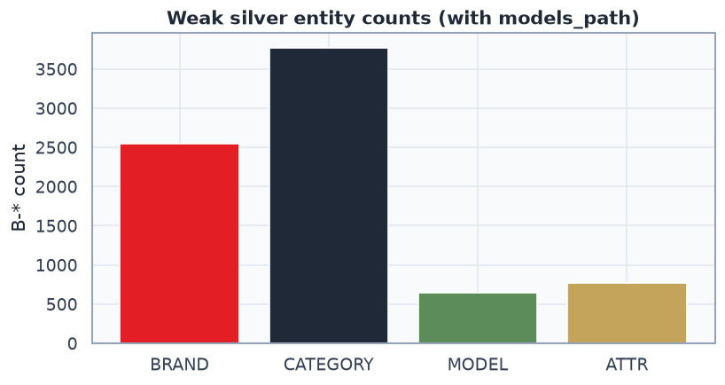

# 01 CRF NER EDA report

## MVP context

- Brand clf + ATTR type clf — MVP готовы; CRF spans — следующий блок.
- ATTR clf воспроизводим: `labeling.py` + markov `02/03` + `models/attr_type_clf.joblib`.
- Этот EDA: качество **weak silver** для будущего `02_crf_classifier`.

## Как классифицирует CRF (spoiler: не TF-IDF)

| | Brand / ATTR-type clf | CRF NER |
|---|---|---|
| Объект | весь query / один ATTR-span | каждый токен в последовательности |
| Фичи | TF-IDF char/word | lower, shape, prefix/suffix, ±соседи |
| Модель | LogReg / SGD | sklearn_crfsuite CRF |
| Опечатки | char n-grams частично ловят | слабо (нет edit-distance) |

## Silver slice

- Queries: **5,000** (cap `5000`)
- Rows: **5,000**, with ≥1 entity: **4,463** (89.3%)
- Dicts: brands=1609, cats=1431, models=6130
- `models_path` ON → MODEL B-counts: **645**; legacy without models rarely emits MODEL (hits on 4k subsample: 0)

| entity | B-* count |
|---|---:|
| BRAND | 2551 |
| CATEGORY | 3769 |
| MODEL | 645 |
| ATTR | 772 |

Mean tokens=3.1, p95=6

## Gold parity (`bio_liza.jsonl`)

- Queries: **200**
- `split` align (tags vs `query.split()`): **200/200**
- `tokenize()` align (prod tokenizer): **181/200**

| gold entity | B-* |
|---|---:|
| CATEGORY | 153 |
| BRAND | 106 |
| ATTR | 91 |
| MODEL | 74 |

CRF игнорирует `subtypes` (это attr-type слой).

## Weak teacher vs gold (span micro)

- precision=0.669 recall=0.491 **F1=0.566** (tp=208 fp=103 fn=216)
- Это потолок silver-обучения: CRF учится копировать teacher, не gold.

### Confusion gold_label → teacher (or MISS)

| gold | teacher | n |
|---|---|---:|
| CATEGORY | CATEGORY | 89 |
| BRAND | BRAND | 86 |
| MODEL | MISS | 62 |
| CATEGORY | MISS | 61 |
| ATTR | MISS | 60 |
| ATTR | ATTR | 22 |
| BRAND | MISS | 19 |
| MODEL | MODEL | 11 |
| ATTR | CATEGORY | 8 |
| CATEGORY | BRAND | 2 |
| CATEGORY | ATTR | 1 |
| BRAND | CATEGORY | 1 |
| ATTR | MODEL | 1 |
| MODEL | CATEGORY | 1 |

## Hard examples (full vs legacy without MODEL)

| query | with models_path | legacy (06/08 style) |
|---|---|---|
| `asus tuf gaming a15 16 гб` | `asus/B-BRAND tuf/B-MODEL gaming/I-MODEL a15/I-MODEL 16/B-ATTR гб/I-ATTR` | `asus/B-BRAND tuf/O gaming/O a15/O 16/B-ATTR гб/I-ATTR` |
| `ноутбук asus 16гб` | `ноутбук/B-CATEGORY asus/B-BRAND 16/B-ATTR гб/I-ATTR` | `ноутбук/B-CATEGORY asus/B-BRAND 16/B-ATTR гб/I-ATTR` |
| `iphone 15 pro max` | `iphone/B-BRAND 15/B-MODEL pro/I-MODEL max/B-BRAND` | `iphone/B-BRAND 15/O pro/O max/B-BRAND` |
| `беспроводные наушники sony` | `беспроводные/B-CATEGORY наушники/I-CATEGORY sony/B-BRAND` | `беспроводные/B-CATEGORY наушники/I-CATEGORY sony/B-BRAND` |
| `телевизор tcl 65` | `телевизор/B-CATEGORY tcl/B-BRAND 65/O` | `телевизор/B-CATEGORY tcl/B-BRAND 65/O` |

## Quality verdict

1. Silver **можно** использовать для MVP CRF, но только с `models_path`.
2. Старые 06/08 / `ner_crf.pkl` **не согласованы** с gold (нет MODEL).
3. Gold tokenize mismatch нужно чинить или переразмечать под `tokenize()` перед hard eval.
4. Val на silver↔silver будет завышен — в `02` обязателен gold F1.

## Artifacts

- `D:\Projects-26-06-2026\mvideo-ner-search\artifacts\silver\ner_bio\silver_bio_slice.parquet`
- `D:\Projects-26-06-2026\mvideo-ner-search\artifacts\silver\ner_bio\silver_bio_preview.parquet`
- `D:\Projects-26-06-2026\mvideo-ner-search\artifacts\silver\ner_bio\eda_meta.json`
- figures: `figures/ner/01_*.png`

Next: `02_crf_classifier.ipynb` — train CRF on this silver, eval on gold.