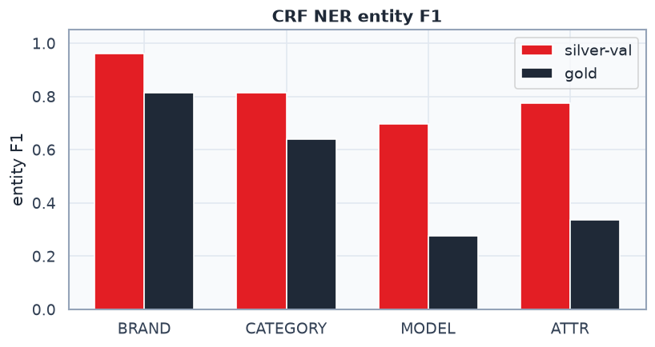

# 02 CRF NER — train report

Model: `models\ner_crf.pkl`  
Silver: `D:\Projects-26-06-2026\mvideo-ner-search\artifacts\silver\ner_bio\silver_bio_slice.parquet`  
Train/val: **3475** / **869** (seed=42)

## Features (not TF-IDF)

Per-token: `word.lower`, prefix/suffix, shape, digit/latin/cyrillic, ±1/±2 neighbors, BOS/EOS.
Typos: weak (no edit-distance).

## Silver-val (weak↔weak, optimistic)

- token accuracy: **0.864**
- entity micro-F1: **0.848** (P=0.853 R=0.842)
- macro-F1: **0.812**

| label | P | R | F1 | support |
|---|---:|---:|---:|---:|
| BRAND | 0.963 | 0.961 | 0.962 | 490 |
| CATEGORY | 0.800 | 0.828 | 0.814 | 726 |
| MODEL | 0.732 | 0.664 | 0.697 | 140 |
| ATTR | 0.862 | 0.704 | 0.775 | 169 |

## Gold (`bio_liza.jsonl`) — primary MVP metric

- used **200/200** (tokenize_align=181, skipped=0)
- token accuracy: **0.582**
- entity micro-F1: **0.592** (P=0.690 R=0.519)
- macro-F1: **0.517**

| label | P | R | F1 | support |
|---|---:|---:|---:|---:|
| BRAND | 0.806 | 0.821 | 0.813 | 106 |
| CATEGORY | 0.635 | 0.647 | 0.641 | 153 |
| MODEL | 0.519 | 0.189 | 0.277 | 74 |
| ATTR | 0.714 | 0.220 | 0.336 | 91 |

## Demos

| query | BIO |
|---|---|
| `asus tuf gaming a15 16 гб` | `asus/B-BRAND tuf/B-MODEL gaming/I-MODEL a15/I-MODEL 16/B-ATTR гб/I-ATTR` |
| `ноутбук asus 16 гб` | `ноутбук/B-CATEGORY asus/B-BRAND 16/B-ATTR гб/I-ATTR` |
| `iphone 15 pro max` | `iphone/B-BRAND 15/B-MODEL pro/I-MODEL max/B-BRAND` |
| `беспроводные наушники sony` | `беспроводные/B-CATEGORY наушники/I-CATEGORY sony/B-BRAND` |

## Notes

1. Silver includes **MODEL** (`models_path`); old 06/08 did not.
2. Trust **gold** more than silver-val.
3. Expand `silver_bio_slice` (more queries) before claiming prod-ready F1.

Artifacts: `models/ner_crf.pkl`, `artifacts/silver/ner_bio/crf_train_metrics.json`.