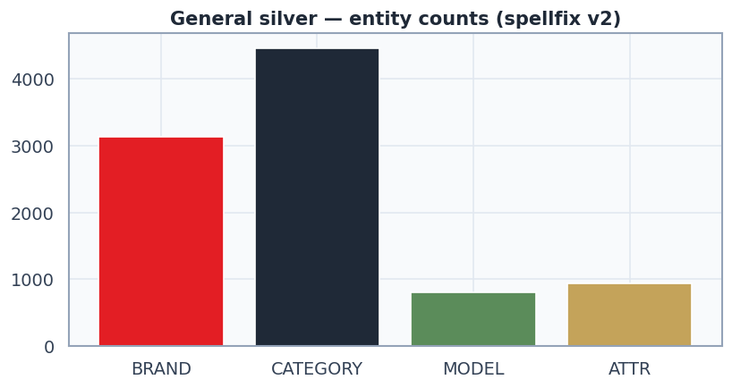

# 01. General study — joint silver + broken queries

Queries сэмплированы: **6000**, silver с сущностями: **5324**.
SpellFix v2 (typo + units + homoglyphs + алиасы) тронул **1068/6000** запросов.
Синтетический broken_queries_eval: **270** строк (порча токенов: раскладка/гомоглиф/дубль/пропуск буквы; количество токенов сохранено — теги валидны).

## Entity counts (with_entity slice)

| label | count |
|---|---:|
| BRAND | 3124 |
| CATEGORY | 4452 |
| MODEL | 810 |
| ATTR | 937 |

## SpellFix v2 — примеры (before -> after)

| before | after | changes |
|---|---|---|
| `минипечь` | `мини-печь` | минипечь→мини-печь |
| `газовая плита с духовкой` | `газовая плита с духовой` | духовкой→духовой |
| `стиральные машины` | `стиральная машины` | стиральные→стиральная |
| `пылесосы с контейнером samsung` | `пылесосы с контейнер samsung` | контейнером→контейнер |
| `морозильная камера` | `морозильник камера` | морозильная→морозильник |
| `микроволновые печи свч lg` | `микроволновка печи свч lg` | микроволновые→микроволновка |
| `стиралка самсунг` | `стиралка samsung` | самсунг→samsung |
| `стмпальные машинки вертикальные` | `стмпальные машинка вертикальные` | машинки→машинка |
| `умные часы самсунг` | `умные часы samsung` | самсунг→samsung |
| `кофемашина делонжи магнифик грей` | `кофемашина делонги магнифик грей` | делонжи→делонги |
| `часы эпл` | `часы apple` | эпл→apple |
| `наушники для компьютера` | `наушники для компьютер` | компьютера→компьютер |

## Broken queries — примеры (query_orig -> query битый)

| orig | broken | n_corrupted |
|---|---|---:|
| `чернила для принтер canon` | `чернила длля принтир canon` | 2 |
| `варочная панель электрическая` | `ваоочная панель электрическая` | 1 |
| `таблетки для посудомоечная машин` | `таблетки дя посудомоечная машин` | 1 |
| `холодильник beko` | `холоодильник beeko` | 2 |
| `парогенератор с утюгом lelit ps 25` | `парогеоератор с утюгом lelit ps 25` | 1 |
| `накладка смартфоны samsung s25 ultra 512` | `накладкка смартфоны samsung s25 ultra 512` | 1 |
| `телевизор смарт тв 43` | `теелевизор смарт тв 43` | 1 |
| `холодильники с нижней морозильник камерой` | `холоодильники с ниижней морозильник камерой` | 2 |
| `зарядное устройство apple` | `зарядноое устройство appple` | 2 |
| `повербанк 80000` | `повербаок 80000` | 1 |
| `кресло кровать` | `креесло кровать` | 1 |
| `колонка алиса lite 2` | `коонка алиса lite 2` | 1 |

## Дальше

`python notebooks/general_study/_run_02.py` — обучение CRF + GLiNER на этом silver и метрика **всего каскада** (rules → CRF → GLiNER) на gold и на broken_queries_eval.