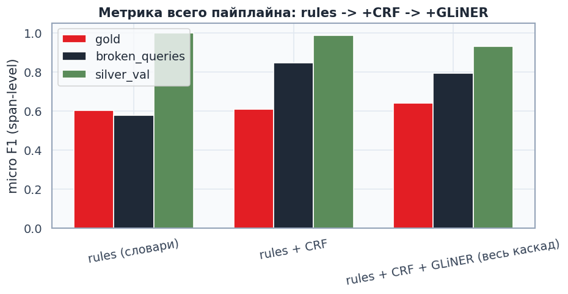

# 02. General study — совместное обучение CRF + GLiNER, метрика всего каскада

CRF и GLiNER обучены на **одном и том же** general silver из `01` (train=4525, GLiNER — сэмпл 500 из них). **Gold не участвует в обучении вообще** — чистый held-out для обеих моделей.
GLiNER threshold откалиброван на silver-val: **0.5**.

## Метрика всего пайплайна (span-level micro F1)

| eval set | n | rules (словари) | rules + CRF | rules + CRF + GLiNER (весь каскад) |
|---|---:|---:|---:|---:|
| gold | 181 | 0.604 | 0.609 | 0.640 |
| broken_queries | 270 | 0.578 | 0.846 | 0.795 |
| silver_val | 799 | 1.000 | 0.987 | 0.931 |

## Подробно (P / R / F1 по стадиям)

### gold

| stage | P | R | F1 | latency/query |
|---|---:|---:|---:|---:|
| rules (словари) | 0.707 | 0.526 | 0.604 | 20.8 ms |
| rules + CRF | 0.690 | 0.545 | 0.609 | 15.4 ms |
| rules + CRF + GLiNER (весь каскад) | 0.674 | 0.609 | 0.640 | 249.3 ms |

### broken_queries

| stage | P | R | F1 | latency/query |
|---|---:|---:|---:|---:|
| rules (словари) | 0.831 | 0.444 | 0.578 | 24.4 ms |
| rules + CRF | 0.871 | 0.823 | 0.846 | 23.1 ms |
| rules + CRF + GLiNER (весь каскад) | 0.757 | 0.837 | 0.795 | 273.6 ms |

### silver_val

| stage | P | R | F1 | latency/query |
|---|---:|---:|---:|---:|
| rules (словари) | 1.000 | 1.000 | 1.000 | 19.3 ms |
| rules + CRF | 0.974 | 1.000 | 0.987 | 18.4 ms |
| rules + CRF + GLiNER (весь каскад) | 0.871 | 1.000 | 0.931 | 263.3 ms |

## Выводы

1. **CRF — главный источник прироста над rules**, особенно там, где важна устойчивость к шуму:
   на `broken_queries` (синтетические опечатки) CRF даёт **+0.268 microF1** (0.578 → 0.846) —
   контекст+shape-фичи вытягивают то, что словарь по точному совпадению теряет.
2. **GLiNER на этом прогоне помог только на gold** (0.609 → 0.640, +0.031), а на
   `broken_queries` и `silver_val` — **просадка** (0.846→0.795 и 0.987→0.931 соответственно).
   Смотрим P/R: recall у GLiNER выше (он находит доп. спаны), но precision заметно ниже —
   на зашумлённом/собственном-teacher тексте GLiNER добавляет **ложные** срабатывания
   быстрее, чем закрывает реальные дыры CRF. Вывод: GLiNER как "слепой" хвост после CRF
   выгоден не всегда — нужен либо более высокий threshold именно в этой роли (сейчас общий
   калиброванный 0.5 неоптимален для broken/silver), либо запускать GLiNER только когда
   CRF+rules **вообще ничего** не нашли в запросе (а не для дозаполнения отдельных спанов).
3. **Опечатки бьют по всему каскаду**: даже лучшая стадия на `broken_queries` (0.846) ниже,
   чем `rules` на чистом `silver_val` (1.000) — SpellFixer снижает урон, но не убирает его
   полностью (см. `01_general_silver_report.md`, `моильник`-класс случаев).
4. Обе модели обучены **без** gold — держим его как честный внешний тест.
5. Модели: `models/general_study/ner_crf.pkl`, `models/general_study/gliner_ner/` (не трогают
   `models/ner_crf.pkl` / `models/gliner_ner/` других треков).