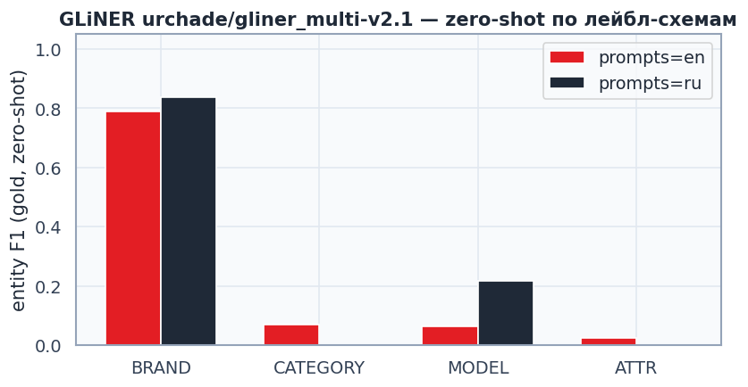

# 01. GLiNER — zero-shot baseline

Модель: `urchade/gliner_multi-v2.1` (multilingual, apache-2.0). Без обучения — то, что даёт HF-чекпоинт из коробки.
Gold: `data/gold/bio_liza.jsonl`, использовано **181** запросов.

## Промпт-схемы (лейблы, которые видит GLiNER)

| our label | en prompt | ru prompt |
|---|---|---|
| BRAND | `brand` | `бренд` |
| CATEGORY | `product category` | `категория товара` |
| MODEL | `product model or model code` | `модель или код модели товара` |
| ATTR | `product attribute or specification` | `характеристика или атрибут товара` |

## Метрики по схемам (span-level, exact match)

| scheme | micro P | micro R | micro F1 | avg latency/query |
|---|---:|---:|---:|---:|
| en | 0.722 | 0.229 | 0.347 | 196.2 ms |
| ru | 0.569 | 0.240 | 0.337 | 197.9 ms |

**Лучшая схема: `en`** (используем в `02_gliner_finetune`).

| label | P | R | F1 | support |
|---|---:|---:|---:|---:|
| BRAND | 0.750 | 0.833 | 0.789 | 90 |
| CATEGORY | 0.714 | 0.036 | 0.069 | 138 |
| MODEL | 0.500 | 0.035 | 0.065 | 58 |
| ATTR | 0.250 | 0.013 | 0.025 | 77 |

## Edge cases (качественно, не в gold)

| query | предсказанные сущности |
|---|---|
| `асус тюф гейминг а15` | BRAND:`асус` |
| `iphone 16 pro max 256` | BRAND:`iphone` |
| `чехол для айфон 15 синий силиконовый` | — |
| `наушники` | BRAND:`наушники` |
| `xiaomi` | BRAND:`xiaomi` |
| `телевизор 65 дюймов 4к` | — |
| `холодильник lg no frost 300 л` | BRAND:`lg` |
| `плойка д/волос` | — |
| `смартфон samsung galaxy s24 ultra 512gb черный` | BRAND:`samsung`, ATTR:`512gb` |
| `非小米平板` | — |

## Выводы

1. Это **точка отсчёта без обучения** — сравниваем с ней fine-tune в `02`.
2. GLiNER — не замена CRF: тяжелее (~0.3B) и медленнее; роль — **хвост** каскада (дыры rules+CRF, новые типы), не каждый запрос.
3. Дальше: `02_gliner_finetune.ipynb` — обучение на gold (+ по необходимости silver).