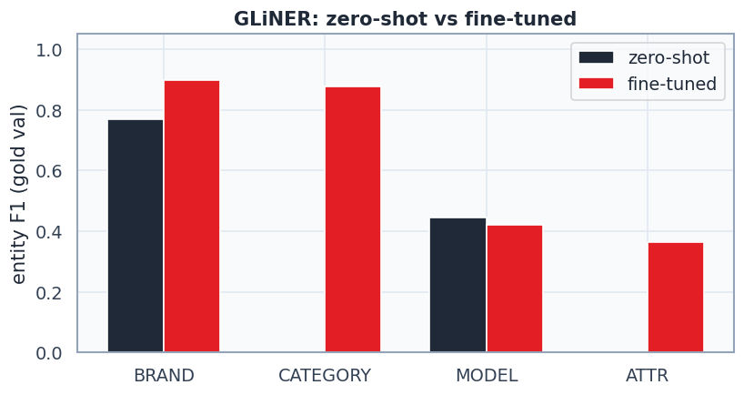

# 02. GLiNER — fine-tune

Модель: `urchade/gliner_multi-v2.1`. Схема лейблов: **ru** (взята из `01_gliner_zero_shot`).
Gold train/val: **154/27** (из 181, seed=42).
Silver-добавка (CRF-пайплайн, со spellfix): **200** примеров.

## До/после (gold val, span-level exact match)

| | micro P | micro R | micro F1 |
|---|---:|---:|---:|
| zero-shot | 0.700 | 0.275 | 0.394 |
| fine-tuned (round 1) | 0.755 | 0.726 | 0.740 |

Прирост microF1: **+0.346**

## Раунды обучения

| round | epochs | lr | секунд | microF1 (val) |
|---|---:|---:|---:|---:|
| 1 | 3 | 1e-05 | 510 | 0.733 |

## Калибровка порога (после обучения)

Модель после обучения — то же, порог отсечения (`threshold`) — гиперпараметр инференса, не требует ретрейна. Default `0.5` резал верные, но неуверенные спаны (типично для ATTR).

| threshold | microF1 (val) |
|---:|---:|
| 0.50 | 0.747 |
| 0.40 | 0.737 |
| 0.35 | 0.740 **← выбран** |
| 0.30 | 0.733 |
| 0.25 | 0.718 |
| 0.20 | 0.731 |
| 0.15 | 0.731 |

**Итоговый порог: 0.35** (было 0.3 по умолчанию до калибровки). Используется в edge cases ниже и должен использоваться при вызове `predict_entities(..., threshold=...)` в проде.

## По лейблам (val, на калиброванном пороге)

| label | zero-shot F1 | fine-tuned F1 |
|---|---:|---:|
| BRAND | 0.769 | 0.897 |
| CATEGORY | 0.000 | 0.878 |
| MODEL | 0.444 | 0.421 |
| ATTR | 0.000 | 0.364 |

## Edge cases: до vs после

| query | zero-shot | fine-tuned |
|---|---|---|
| `асус тюф гейминг а15` | BRAND:`асус`, MODEL:`а15` | BRAND:`асус`, MODEL:`а15` |
| `iphone 16 pro max 256` | — | BRAND:`iphone`, ATTR:`256` |
| `чехол для айфон 15 синий силиконовый` | MODEL:`синий` | CATEGORY:`чехол`, BRAND:`айфон`, MODEL:`синий`, ATTR:`силиконовый` |
| `наушники` | MODEL:`наушники` | CATEGORY:`наушники` |
| `xiaomi` | BRAND:`xiaomi` | BRAND:`xiaomi` |
| `телевизор 65 дюймов 4к` | MODEL:`телевизор`, MODEL:`4к` | CATEGORY:`телевизор`, MODEL:`65 дюймов`, MODEL:`4к` |
| `холодильник lg no frost 300 л` | BRAND:`lg` | CATEGORY:`холодильник`, BRAND:`lg`, ATTR:`no frost`, ATTR:`300 л` |
| `плойка д/волос` | — | CATEGORY:`плойка` |
| `смартфон samsung galaxy s24 ultra 512gb черный` | BRAND:`samsung`, MODEL:`черный` | CATEGORY:`смартфон`, BRAND:`samsung`, ATTR:`512gb`, MODEL:`черный` |
| `非小米平板` | — | — |

## Выводы

1. Fine-tune на 154 gold + 200 silver -> microF1 0.394 → 0.740.
2. Gold всего 200 строк — как будет больше размеченного (`data/gold/bio_liza.jsonl` растёт), перезапустить этот скрипт заново, F1 должен подрасти дальше.
3. GLiNER остаётся **хвостом** каскада (rules → CRF → GLiNER), не заменой CRF на всём трафике (latency ~188ms/query на CPU).
4. Модель сохранена в `models/gliner_ner/` (не в git — см. `.gitignore`).