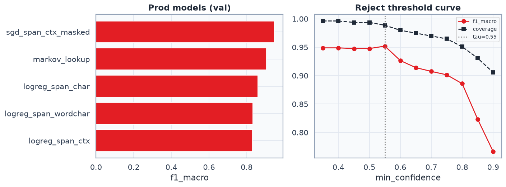

# ATTR type classifier — prod report

Модель: **`sgd_span_ctx_masked`** → `models/attr_type_clf.joblib`  
Policy: `artifacts/silver/attr_type/inference_policy.json` (τ=`0.55`)  
Sanity: **6/10** кейсов  
gold mapped agree (teacher vs app→canon): **62/91** (68.1%) — jsonl не меняли

Канон: unit-типы + `color` + **`type`/`purpose`** (см. `data/gold/ATTR_SUBTYPES.md`).

## Зачем классификатор, а не только regex

NER отдаёт общий `ATTR`. Тип нужен для фактов/поиска. Regex-учитель даёт silver,
clf обобщает опечатки/усечения (`16 г`, `4к`) и умеет **reject** при низкой уверенности.

## Что такое фичи (пример: `ноутбук asus 16 г`)

| фича | значение | что кодируем |
|---|---|---|
| `span_text` | `16 г` | n-grams **только** span → сигнал единицы |
| `context_text` | `asus ноутбук` | бренд+категория отдельно |
| `query_masked` | `ноутбук asus <ATTR>` | запрос без чужих ATTR (`<ATTR>`) |

Важно: **не** кормим TF-IDF строкой `16 г 15.6 дюйм` — типы смешаются.

```text
query:  ноутбук asus 16 г
         CATEGORY BRAND ATTR

X1 = TFIDF("16 г")              # char: "16", "6 ", " г", ...
X2 = TFIDF("asus ноутбук")     # контекст
X3 = TFIDF("ноутбук asus <ATTR>")
y  = memory_storage
```

## Исправления учителя (гипотезы)

| было | стало | зачем |
|---|---|---|
| `16 г` → weight | → **memory_storage** (RAM-like + `г`/`g`) | усечение «гб» в поиске |
| `5 g` / `256 g` → weight | 5g → other/UNKNOWN; 256 g → memory | шум 5G / truncated gb |
| `1920x1080` → dimensions | → **resolution_exact** | порядок regex |
| weight = `г\|g\|грамм` | weight = кг/грамм | убрали омонимию |
| нет type/purpose | **type** / **purpose** lexical | sync с app gold |

## Метрики val (после relabel)

| model | acc | f1_macro | multi_f1_macro | f1_UNKNOWN |
|---|---:|---:|---:|---:|
| `sgd_span_ctx_masked` | 0.971 | **0.947** | 0.947 | 0.931 |
| `markov_lookup` | 0.953 | 0.905 | 0.959 | 0.876 |
| `logreg_span_char` | 0.958 | 0.860 | 0.805 | 0.893 |
| `logreg_span_wordchar` | 0.955 | 0.833 | 0.805 | 0.884 |
| `logreg_span_ctx` | 0.957 | 0.832 | 0.842 | 0.897 |

С reject τ=0.55: acc **0.971**, macro **0.952**, coverage **98.9%**.



## Sanity 10 (ручной демо-набор)

| span | expect | pred | conf | ok | teacher |
|---|---|---|---:|:---:|---|
| `16 г` | memory_storage | UNKNOWN | 0.50 | FAIL | memory_storage |
| `16 гб` | memory_storage | memory_storage | 0.85 | OK | memory_storage |
| `256 g` | memory_storage | memory_storage | 0.97 | OK | memory_storage |
| `5 g` | UNKNOWN | memory_storage | 0.87 | FAIL | other |
| `2 кг` | weight | weight | 0.91 | OK | weight |
| `150 грамм` | weight | size | 0.72 | FAIL | weight |
| `1920x1080` | resolution_exact | resolution_exact | 0.85 | OK | resolution_exact |
| `4k` | resolution_standard | UNKNOWN | 0.50 | FAIL | resolution_standard |
| `15.6 дюйм` | size | size | 0.97 | OK | size |
| `g pro` | UNKNOWN | UNKNOWN | 1.00 | OK | other |

## Per-class F1 (best, без reject)

| class | precision | recall | f1 | support |
|---|---:|---:|---:|---:|
| color | 1.000 | 1.000 | 1.000 | 119 |
| connectivity | 1.000 | 1.000 | 1.000 | 35 |
| frequency | 1.000 | 1.000 | 1.000 | 8 |
| power | 1.000 | 1.000 | 1.000 | 19 |
| resolution_standard | 1.000 | 1.000 | 1.000 | 5 |
| time | 1.000 | 1.000 | 1.000 | 4 |
| size | 0.978 | 1.000 | 0.989 | 87 |
| type | 0.987 | 0.982 | 0.984 | 225 |
| volume | 1.000 | 0.967 | 0.983 | 30 |
| memory_storage | 0.982 | 0.982 | 0.982 | 55 |
| weight | 1.000 | 0.909 | 0.952 | 22 |
| voltage | 0.889 | 1.000 | 0.941 | 8 |
| UNKNOWN | 0.918 | 0.944 | 0.931 | 143 |
| current | 0.857 | 1.000 | 0.923 | 6 |
| resolution_exact | 0.818 | 0.900 | 0.857 | 10 |
| purpose | 0.909 | 0.714 | 0.800 | 14 |
| dimensions | 1.000 | 0.600 | 0.750 | 5 |

## Применимость в прод / демку

| Можно | Нельзя / осторожно |
|---|---|
| Типичные единицы с полной формой (`16 гб`, `2 кг`, `55 дюйм`) | Голые токены `v`, `l`, `tb` без числа |
| Усечённая память RAM-like (`16 г`, `256 g`) | Редкие типы (ом, мпикс) → UNKNOWN |
| Reject при conf < τ | Верить val 0.97 как gold — нет, ждём gold-set |
| Fallback после NER ATTR-span | Заменять regex-учитель целиком без мониторинга |

## Обоснованность

1. **Задача узкая**: тип span, не полный NER — TF-IDF n-gram достаточен.
2. **Фичи изолированы** — нет протекания единиц между ATTR.
3. **Учитель починен** под реальные запросы М.Видео (усечения, 5G-шум).
4. **Reject** снижает риск уверенно-неправильных ответов в демке.
5. **Ограничение**: silver всё ещё regex-circular; final sign-off — на gold.

## Как звать в демо

```python
from src.ner.attr_type_clf import predict_attr_type
predict_attr_type('16 г', brand='asus', category='ноутбук',
                  query_masked='ноутбук asus <ATTR>', return_details=True)
```
